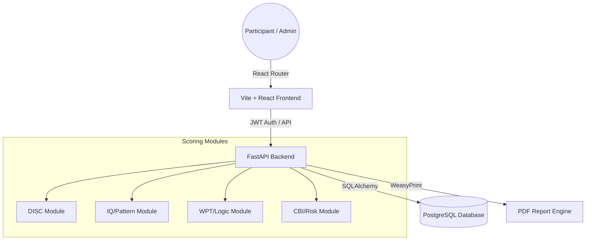

# Psikotes Platform – Andamas Standard

[](https://github.com/Acerasien/web-psikotes)
[](#design-philosophy)

A professional, high-performance psychological assessment platform designed for corporate recruitment and internal auditing. Built with a focus on data precision, administrative efficiency, and a premium "Industrial Utilitarian" aesthetic.

---

## 🏗️ Technical Architecture

The platform follows a modern decoupled architecture:



---

## ✨ Key Features

### 🛡️ Administrative Dashboard
- **Comprehensive Management**: Full-page workflows for creating and managing Admins and Participants.
- **Persistent Intelligence**: URL-synchronized filters for the participant list (status, search, etc.) that survive navigation and refreshes.
- **Bulk Operations**: High-speed participant import via CSV/Excel supporting custom fields (Department, Business Unit, position).
- **Audit Logs**: Tracking test attempts and completion status in real-time.

### 🧠 Advanced Assessment Suite
- **DISC Personality Profiling**: Detailed natural vs. under-pressure behavioral analysis.
- **WPT (Wonderlic Personnel Test) Standard**: 50-item logic & arithmetic assessment mapped to 12 cognitive tiers including Estimated IQ and Career Recommendations.
- **CBI (Counterproductive Behavior Index)**: Specialized integrity screening with static, always-visible trait interpretations.
- **Memory (MEM)**: Digit and recall performance tracking with accuracy metrics.
- **Speed & Accuracy**: High-pressure performance testing with visualizers.
- **Temperament & PAPI**: Multi-axial behavioral orientation tests.

### 📊 Professional Reporting
- **Industrial Dashboard**: High-contrast, data-dense participant profiles with specialized visualizers for every test module.
- **Automated PDFs**: One-click generation of comprehensive psychological reports with professional banding and standardized interpretations.

---

## 🎨 Design Philosophy
The "Industrial Utilitarian" aesthetic prioritizes clarity and professional weight:
- **High Contrast**: Deep neutral-900 backgrounds with stark white and accent-gold headers.
- **Data-Sheet Styling**: Sharp 2px borders, mono-spaced technical fonts for metrics, and distinct "data-card" layouts.
- **Functional Animation**: Micro-interactions designed for professional feedback rather than simple decoration.

---

## 🚀 Getting Started

### Backend Setup (FastAPI)
1. **Initialize Environment**:
   ```bash
   cd server
   python -m venv .venv
   source .venv/bin/activate  # Windows: .venv\Scripts\activate
   ```
2. **Install Dependencies**:
   ```bash
   pip install -r requirements.txt
   ```
3. **Database & Seeding**:
   ```bash
   # Initialize logic/questions and create superadmin
   python seed_all.py 
   ```
4. **Run Server**:
   ```bash
   python -m uvicorn main:app --reload
   ```

### Frontend Setup (Vite)
1. **Install Dependencies**:
   ```bash
   cd client
   npm install
   ```
2. **Environment Configuration**:
   Create a `.env` file based on `.env.example`.
3. **Run Development Server**:
   ```bash
   npm run dev
   ```

---

## 🛠️ Tech Stack
- **Frontend**: React 18, Vite, Tailwind CSS, Headless UI, Heroicons.
- **Backend**: FastAPI, SQLAlchemy, Pydantic, WeasyPrint.
- **Database**: PostgreSQL.
- **Language**: Python 3.9+, Javascript (ES6+).

---

## 📂 Project Structure
```text
├── client/          # Vite + React source code
│   ├── src/
│   │   ├── pages/   # Dashboard and Profile views
│   │   ├── components/ # Reusable UI blocks
│   │   └── contexts/# Auth and State management
├── server/          # FastAPI source code
│   ├── routes/      # API endpoints (Auth, Users, Results)
│   ├── scoring/     # Logic for each psychological test
│   ├── services/    # PDF Generation and external utilities
│   └── seed_*.py    # Database initializations
└── README.md        # This documentation
```

---
*Developed by the Google Deepmind Agentic Coding Team for PT. Digdoyo Bowo Leksono & Andamas Group.*
